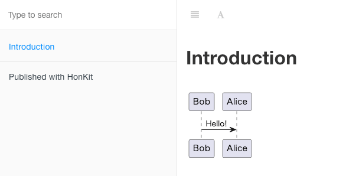

# HonKit PlantUML Plugin

[](https://badge.fury.io/js/honkit-plugin-plantuml-server)

[](https://opensource.org/licenses/MIT)

PlantUML plugin for HonKit. **No Java or Graphviz required** .

The plugin supports APIs  as follows for generating UML diagrams.

* [PlantUML Online Server](http://www.plantuml.com/plantuml/)
* Your own [PlantUML Server](https://github.com/plantuml/plantuml-server)

The plugin uses plantuml online server by default, so it works with **zero-config** .

In this case your diagram is rendered on a public server. If you care about privacy, I recommend building your own server.

## Installation

* Execute the following command.
  ```sh
  npm install honkit-plugin-plantuml-server
  ```
* Write the following in `book.json`.
  ```json
  {
    "plugins": [
      "plantuml-server"
    ]
  }
  ```

## How To Use

Write a code block quote specified to the `plantuml` language in markdown.

For example, if you write the following in README.md:

<pre>
# Introduction

```plantuml
Bob->Alice : Hello!
```
</pre>

Then it will be displayed like this.



You can also use `uml` / `puml` as the language specification.

## Configuration

|Option|Default|Description|
|-|-|-|
|server|*http://www.plantuml.com/plantuml/* |URL for rendering on your own server|
|format|*svg*|Supports *png* and *svg*|
|cacheDir|`os.tmpdir()`|Directory to cache rendered results. If `null` is specified, cache is not used.|
|cssClass|plantuml|CSS class name given to the rendered figure.|

A `book.json` describing these would look like this, for example:

```json
{
  "plugins": [
    "plantuml-server"
  ],
  "pluginsConfig": {
    "plantuml-server": {
      "server": "http://your-server.local/plantuml/",
      "format": "png",
      "cacheDir": "/tmp"
    }
  }
}
```

## Contributing and Development

```sh
$ git clone https://github.com/KentarouTakeda/honkit-plugin-plantuml-server.git
$ cd honkit-plugin-plantuml-server
$ npm install
$ npm test
```

## License

HonKit PlantUML Plugin is open-sourced software licensed under the [MIT license](https://opensource.org/licenses/MIT).
